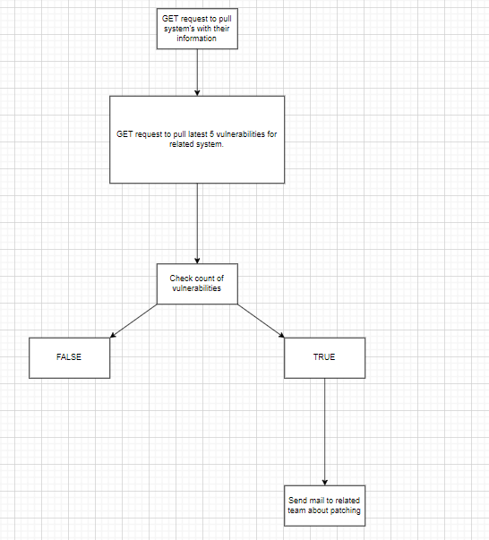
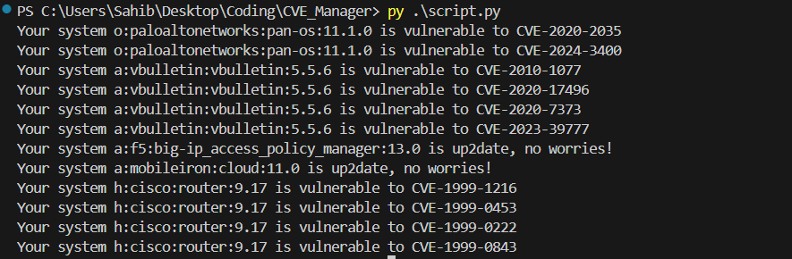

# CVE Manager

## Links

[](https://www.linkedin.com/in/Dr4ks/)
[](https://www.hackerrank.com/Dr4ks)
[](https://tryhackme.com/p/Dr4ks)
[](https://app.hackthebox.com/profile/1037035)
[](https://github.com/Dr4ks)

## Content
- [Description](#description)
- [Infrastructure Information](#infrastructure-information)
- [Workflow](#workflow)
- [Example](#example)


## Description

This script is considered to keep up2date for Vulnerability Management through different systems and services. For this project, I will use [NVD API](https://nvd.nist.gov/developers/vulnerabilities) to pull vulnerabilities for systems and services.


## Infrastructure Information

We have [data](systems.json) which contains related information for our systems,applications,operating systems,firmware,hardware and installed softwares.
This related information structure is considered as below.
```json
{
        "type":"type_of_system",
        "name": "name_of_system",
        "version": "version_of_system",
        "owner team": "owner_team_of_system" 
}
```

**Note:** `Type` of systems can be below predefined values.
```bash
h: Hardware (e.g., device model)
o: Operating System
a: Application
f: Firmware
i: Installed software
```

## Workflow



You can also get `.drawio` file from [here](CVE_Manager.drawio)


## Example

You can see output as below.





# Author
- [@dr4ks](https://github.com/Dr4ks)
